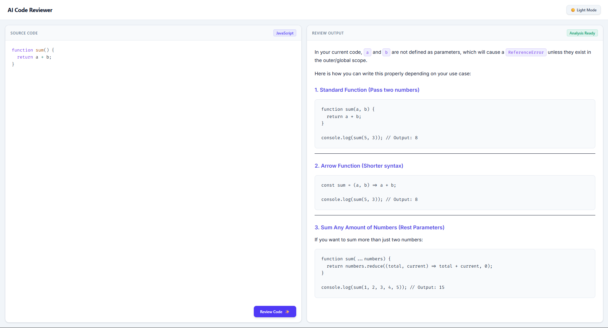
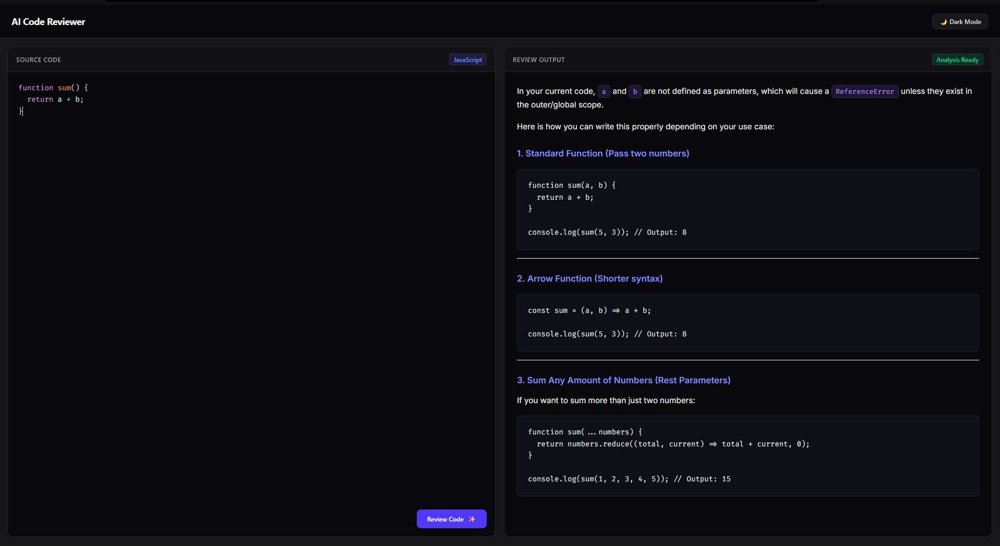

# ⚡ AI Code Reviewer

[](https://react.dev/)
[](https://nodejs.org/)
[](https://expressjs.com/)
[](https://tailwindcss.com/)
[](https://ai.google.dev/)

An intelligent, full-stack web application designed to act as a **Senior AI Code Reviewer (7+ Years Experience)**. It analyzes developer source code in real time, detects bugs, security risks, and performance bottlenecks, and provides refactored code solutions following SOLID principles and industry best practices.

---

## 📸 Screenshots

### ☀️ Light Mode


### 🌙 Dark Mode


---

## ✨ Features

- 🤖 **Senior AI Reviewer (7+ YOE Prompting)**: Leverages Google Gemini LLM API to deliver actionable feedback on code quality, DRY/SOLID principles, security risks, and performance optimizations.
- ⚡ **Instant Live Analysis**: Real-time feedback with markdown block formatting and code refactored snippets.
- 🎨 **Theme-Aware Interface**: Persistent Dark & Light modes with zero screen flashes on refresh.
- 💻 **PrismJS Syntax Highlighting**: Saturated, high-contrast code highlighting for JavaScript syntax in both Light and Dark themes.
- ⌨️ **Keyboard Ergonomics**: Press `Ctrl + Enter` (or `Cmd + Enter`) inside the editor to trigger instant code reviews.
- 🔄 **Multi-Model Fallback Resilience**: Built-in backend retry loop and model fallback handler to withstand temporary 503 high demand spikes and rate limits seamlessly.
- 📋 **Quick Action Productivity**: One-click **Copy Code**, **Clear Editor**, and **Copy Review** output buttons.

---

## 🛠️ Technology Stack

| Layer | Technologies Used |
| :--- | :--- |
| **Frontend** | React , Tailwind CSS, React Markdown, Rehype Highlight, PrismJS |
| **Backend** | Node.js, Express 5, `@google/genai` SDK, CORS, Dotenv |
| **AI Model** | Google Gemini AI (`gemini-3.7-flash` / `gemini-3.6-flash`) |

---

## 📁 Project Architecture

```
AI-Code-Reviewer/
├── Frontend/                 # React SPA (Vite)
│   ├── src/
│   │   ├── components/      # UI components (CodeEditor, ReviewOutput, Navbar)
│   │   ├── context/         # ThemeContext provider
│   │   ├── hooks/           # Custom React hooks (useCodeReview)
│   │   ├── services/        # Decoupled API service client (api.js)
│   │   ├── App.jsx          # Main application container
│   │   └── index.css        # Tailwind directives & Prism contrast rules
│   └── package.json
└── backend/                 # Express API Server
    ├── src/
    │   ├── controllers/     # AI controller & REST JSON error handler
    │   ├── routes/          # AI router (/ai/get-review)
    │   ├── services/        # Gemini API service & prompt instructions
    │   └── app.js           # Express middleware & health check route
    ├── server.js            # Server entry point
    └── package.json
```

---

## 🚀 Getting Started

### Prerequisites

Ensure you have the following installed on your machine:
- **Node.js** (v18.0.0 or higher)
- **npm** (v9.0.0 or higher)
- A **Google Gemini API Key** (get one free at [Google AI Studio](https://aistudio.google.com/app/apikey))

---

### 1. Clone the Repository

```bash
git clone https://github.com/your-username/AI-Code-Reviewer.git
cd AI-Code-Reviewer
```

---

### 2. Backend Setup

```bash
cd backend
npm install
```

Create a `.env` file in the `backend/` directory:

```env
PORT=3000
GOOGLE_GEMINI_KEY=your_gemini_api_key_here
GEMINI_MODEL=gemini-3.7-flash
```

Start the backend development server:

```bash
node --watch server.js
```

The backend server will run on `http://localhost:3000`.

---

### 3. Frontend Setup

In a new terminal window:

```bash
cd Frontend
npm install
```

Create a `.env` file in the `Frontend/` directory (optional):

```env
VITE_API_URL=http://localhost:3000
```

Start the Vite development server:

```bash
npm run dev
```

Open `http://localhost:5173` in your browser!

---

## 📡 API Endpoints

### 1. `POST /ai/get-review`
Sends source code to the backend for AI review.

- **Request Body**:
  ```json
  {
    "code": "function sum(a, b) { return a + b; }"
  }
  ```
- **Response**: Returns a structured Markdown string containing Code Quality Analysis, Recommended Fix, and Key Improvements.

### 2. `GET /health`
Returns backend health status.

- **Response**:
  ```json
  {
    "status": "OK",
    "timestamp": "2026-08-24T05:00:00.000Z"
  }
  ```

---

## 📄 License

This project is licensed under the [ISC License](LICENSE).

---

## 👨‍💻 Author

Crafted with ❤️ by **Shivam Kumar**  
GitHub: [@shivamkumartech](https://github.com/shivamkumartech)
